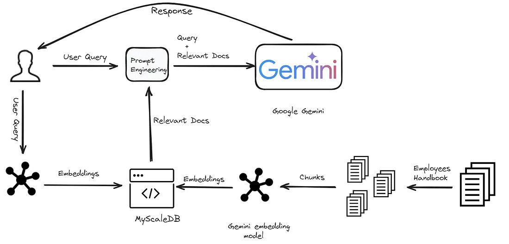

# RAG-Powered Chatbot with Google Gemini and MyScaleDB



This project demonstrates how to build a **Retrieval-Augmented Generation (RAG) powered chatbot** using **Google Gemini** and **MyScaleDB**. The chatbot retrieves relevant information from a database and generates contextually accurate responses based on the retrieved data.

## Workflow

1. **User Input**: The chatbot receives a query from the user.
2. **MyScaleDB Retrieval**: The chatbot searches MyScaleDB for relevant information based on the user's query.
3. **Google Gemini Processing**: The retrieved data is passed to Google Gemini, which generates a response.
4. **Generated Response**: The chatbot returns the generated response to the user.

This workflow ensures that the chatbot provides informative and accurate responses by leveraging external data for context before generating an answer.

## Setup Instructions

1. **Clone the repository**:
    ```bash
    git clone  https://github.com/Barri-FZ2001/RAG-Powered-Chatbot-with-Google-Gemini-and-MyScaleDB-Project.git
    cd RAG-Powered-Chatbot-with-Google-Gemini-and-MyScaleDB-Project
    ```

2. **Install dependencies**:
    ```bash
    pip install -r requirements.txt
    ```

3. **Run the Rag system**:
    ```bash
    python rag_with_gemini.py
    ```

## Key Technologies

- **Google Gemini**: Used for processing and generating human-like text responses.
- **MyScaleDB**: The database used to store and retrieve relevant information for context.

